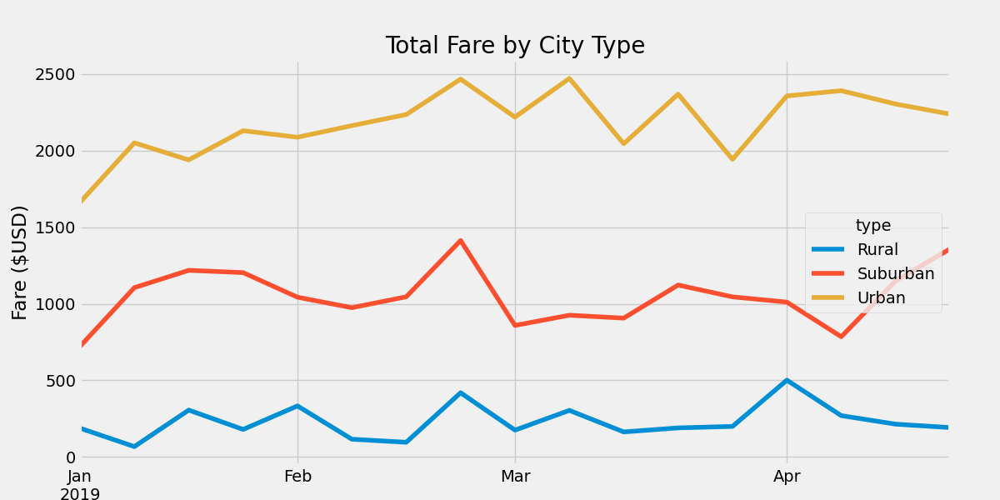

# PyBer_Analysis

---
## Project Overview 

Using Python and Pandas, and data provided by the ride sharing company PyBers, I created a summary DataFrame of the ride-sharing data by city type. Using Matplotlib, I then created a graph showing the total weekly fares for each city type. 

Using the "groupby" function with the "count" and "sum" methods, we were tasked with finding the total number of rides, total number of drivers, and the total fares for each city type. We then calculated the average fare per ride and average fare per driver for each city type. 

---
Resources  - Software: Python 3.9.12, matplotlib 3.5.2

---
## Summary 

The analysis of the data shows that: 
  - There were 2375 trips in the dataset. 

  - The trips were split between demographic areas based on density
  
    |City Type|Number of Rides|
    |---|---|
    |Rural     |     78|
    |Suburban|       490|
     |Urban|         2405|
    
  - Data requested was a sum of total rides, total drivers, total fares, in addition to the average fare per ride and driver, and total fare by city type.

    |         |Total Rides	  |Total Drivers	  |Total Fares	  |Average Fare per Ride	  |Average Fare per Driver|
    |---          |-------        |-------          |-------        |-------                  |------- 
    |Rural	  |125	          |78	              |$4,327.93	    |$34.62	                  |$55.49|
    |Suburban	|625	|490	|$19,356.33	|$30.97	|$39.50|
    |Urban	|1,625	|2,405	|$39,854.38	|$24.53	|$16.57|

    

---
## Recommendations based on rideshare data:

The single largest takeaway from this analysis is that Pyber needs to recruit more rural drivers. Not only do rural drivers drive more miles per trip, thus reducing transactional costs, but the opportunty for growth is greatest in rural markests due to the cronicly poor roll-out of new services to these areas. Being first-to-market in these areas is doubly important given the difficulty of convincing the inhently conservative and increasingly aged rural populations to try new services. 

